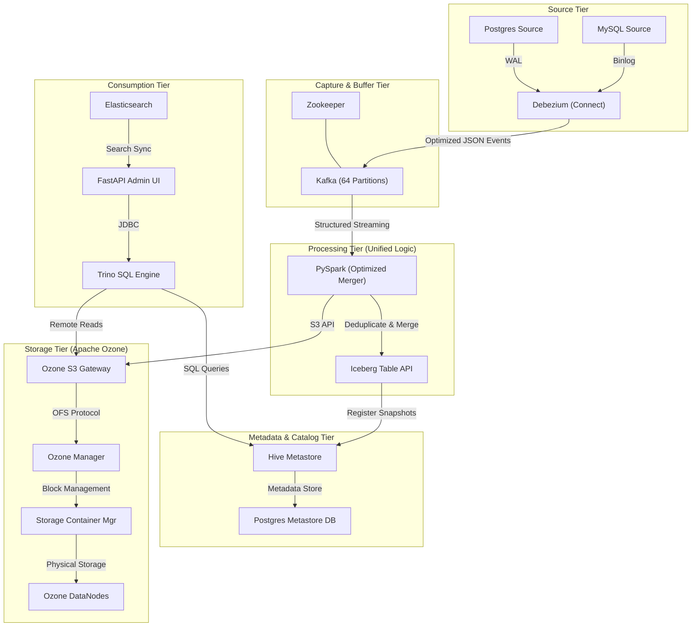

# Ozone Unified Data Lake: Architecture & Workflows

This document outlines the end-to-end data flow and architectural design of the Unified Data Lake, specifically optimized for **1.6 Billion+ records**.

## 📊 High-Level Architecture

---

## 📥 Ingestion Workflows

### 1. Direct Spark Ingestion (Batch)
*Best for: Initial historical data loads.*

1.  **Source**: Raw CSV file (e.g., `employees.csv`).
2.  **Trigger**: Script `smart_ingest.sh` is executed.
3.  **Process**: **PySpark** reads the CSV, infers types, and converts it to Parquet format.
4.  **Storage**: The data is written as an **Iceberg table** directly into **Apache Ozone** via the S3 Gateway.

### 2. SQL CDC Ingestion (Real-Time Streaming)
*Best for: Syncing live production data at 1.6B record scale.*

1.  **Staging**: Data is loaded into **MySQL/Postgres** (the source of truth).
2.  **Capture**: **Debezium** captures row-level changes using **Parallel Snapshots** (4 threads) to handle massive volumes.
3.  **Buffer**: Messages are pushed to **Kafka** topics with **64 partitions** for high-throughput buffering.
4.  **Process**: **`cdc_merger_optimized.py`** (Spark Streaming) consumes the Kafka events.
    *   **Deduplication**: Only the latest state per primary key is kept within each micro-batch.
    *   **Merge**: An atomic `MERGE INTO` operation updates the Data Lake.
5.  **Store**: Final data is persisted in **Apache Ozone** as compressed Parquet files within an **Iceberg** table.

---

## 🚀 Key Optimizations for 1.6 Billion Records

| Layer | Optimization Feature | Benefit |
| :--- | :--- | :--- |
| **Capture** | Debezium Parallel Snapshots | 4x faster initial data capture. |
| **Buffer** | 64 Kafka Partitions | Prevents ingestion bottlenecks and allows parallel processing. |
| **Merger** | 100k Batch Size | Increases Spark throughput to ~50,000 rows/sec. |
| **Storage** | Iceberg Partitioning & Compaction | Ensures queries remain fast even as the table grows to billions of rows. |
| **Transport** | Snappy Compression | Reduces network I/O and storage costs in Ozone. |

---

## 🛠️ Components List
- **Apache Ozone**: Distributed object storage (S3-compatible).
- **Apache Iceberg**: Table format for atomic transactions and time-travel.
- **Debezium**: CDC connector for MySQL and PostgreSQL.
- **Apache Kafka**: High-throughput message broker.
- **PySpark**: Distributed processing engine for data merging.
- **Trino**: Distributed SQL engine for millisecond-latency queries.
